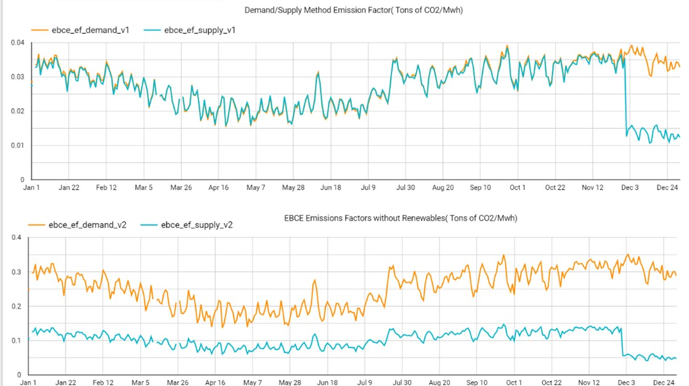
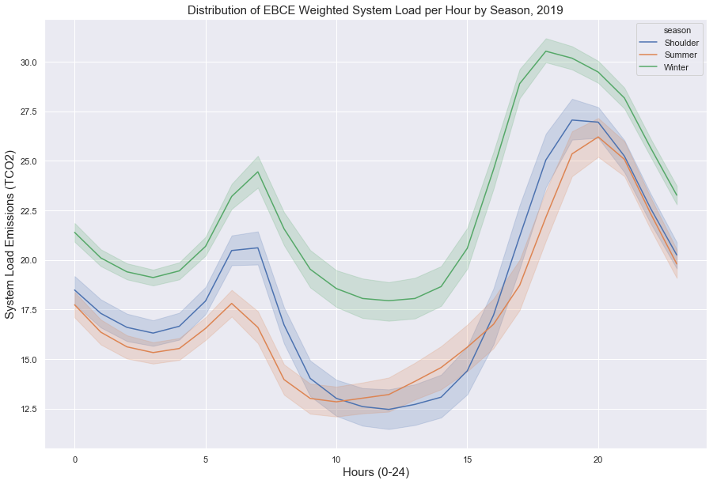
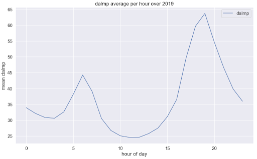
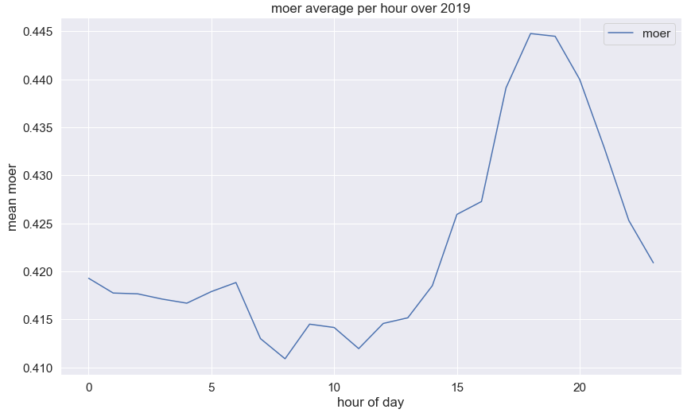
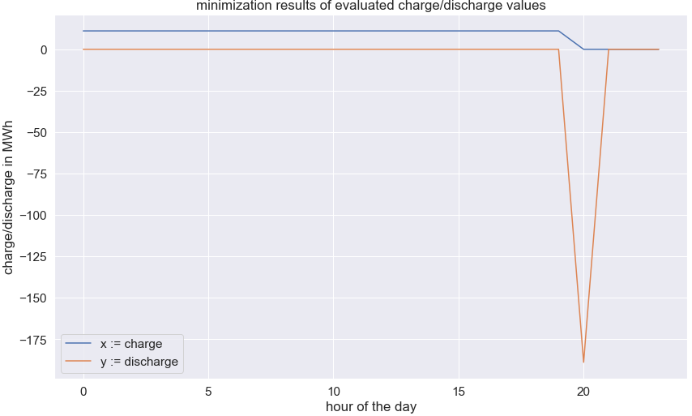
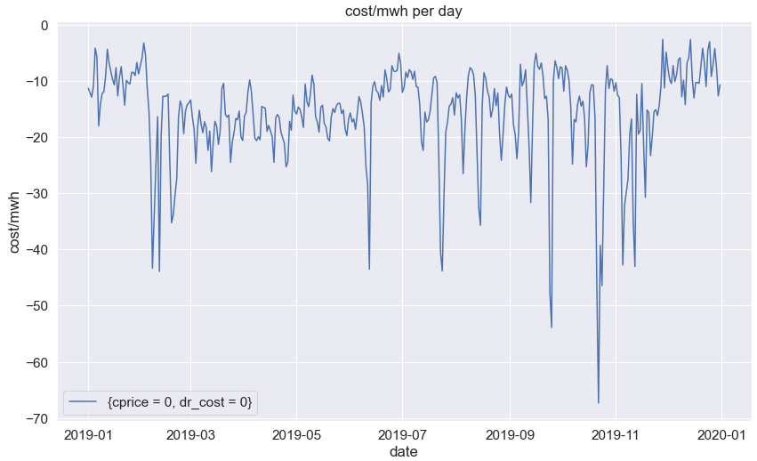
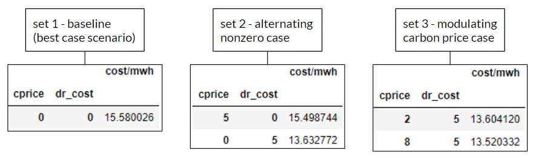
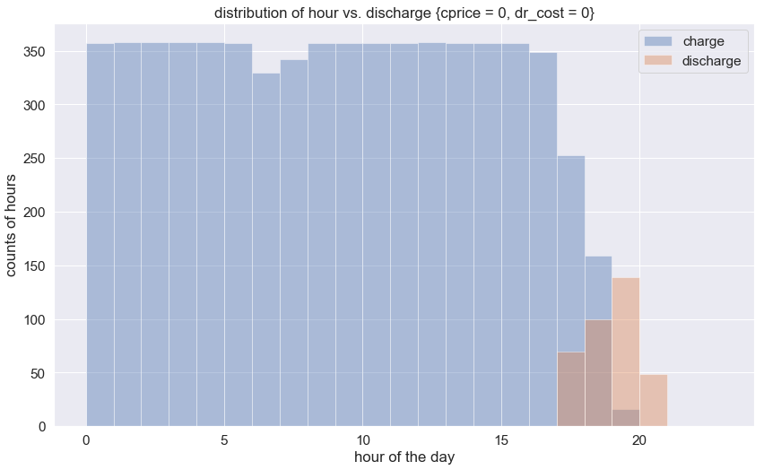
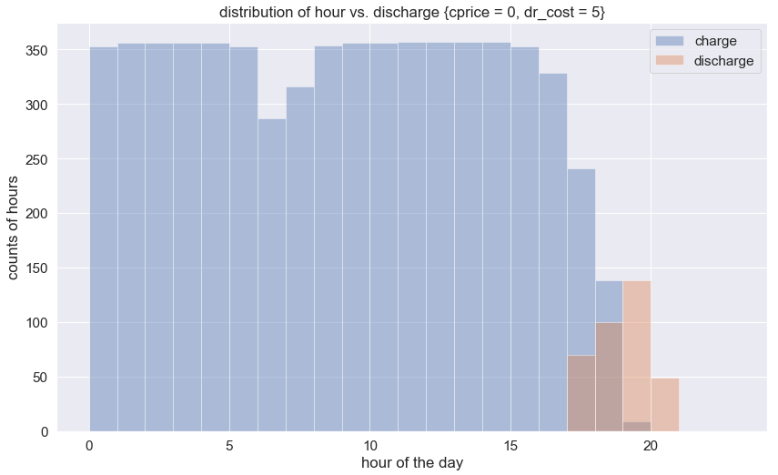

**EBCE Lead:** Kevin Li

**Undergraduate Researchers:**

Abhay Aggarwal

Pavan Gowda

Brandon Zhong

# EBCE CO2 Emissions

As millions of acres continue to burn and as Pacific sea levels continue to rise, the need for GHG reductions in California has become self-evident.  In the Bay Area, East Bay Community Energy (EBCE) has played a vital role in helping Alameda County reduce its CO2 emissions by providing cleaner energy at competitive rates, which allows customers to simultaneously save money and the environment.  

This semester we worked closely with the EBCE Data Science team to compare different CO2 accounting methods, visualize CO2 emission trends for 2019 and optimized the performance of batteries for the purposes of distributing power to meet demand, given forecasted marginal emissions and day-ahead locational marginal pricing (da_lmp).

## Accounting Methods

To calculate hourly CO2 emissions, we tried two different accounting methods- a Demand Method and a Supply Method and used data provided by EBCE. 

*   The Demand method is based on EBCE’s retail products, which consist of Bright Choice (85% carbon free), Brilliant 100 (100% carbon free), and Renewable 100 (100% carbon free). 
*   The Supply method is based on EBCE’s contracted energy and carbon offset attributes. To convert the energy to tons of CO2, our team calculated an hourly emissions factor (tCO2/MWh) by scraping data from the CAISO website. 

Once we calculated CO2 emissions, we then calculated EBCE’s hourly emissions factor (tCO2/MWh) for both methods. For each accounting technique, we had two different emissions factors- 

*   Version 1, in which used the total energy (MWh) demanded at the hour
*   Version 2 where we used energy only from non-renewable sources.

Figure 1 shows that version 1 supply and demand emissions factors are a magnitude smaller than Version 2 emission factors. Further analysis of version 1 shows that the two accounting methods produced nearly identical results until December where Supply method emissions dropped drastically. This was due to the inclusion of ACS3 Specified Energy. Additionally, the impacts of the accounting procedures can be seen in the emissions factor with version2, as Supply method emissions factors were much lower than Demand method emission factors. This is due to the differences in how we removed renewable energy between the two methods.

## Initial Analyses and Relationships

### T-Testing

To gain an overhead view of the system load emissions data, and understand different correlations, we created categorizations of the data by time of day, season, day of the week. We then visualized these categorizations over the different years in question (2018, 2019, 2020).

Below, in Figure 2, this is a visualization of the average 2019 system load emissions (in CO2) at each hour (divided by season). Some standout observations include system load emissions being higher in winter at all hours, with summer emissions generally being lower than shoulder emissions1. 

When conducting t-testing on this data, to see if the differences in averages for the seasons were statistically significant, and whether the different periods of the day2 had statistically significant differences, we found fairly notable results:

*   **All seasons had a statistically significant differences** amongst themselves, with **p-values less than 0.001** when comparing any pair of seasons
*   All the periods of the day, listed in the footnotes, were also **statistically significant** in their differences, which was observed by the troughs and valleys based on time of day

### Temperature and Emissions

We were also interested in modeling the relationship between temperature and daily CO2 emissions. We conducted a linear regression with total daily CO2 emissions(demand method) as the independent variable, and used degree-day (distance between daily temperature and 68) and the emissions for each of the previous 7 days (lag1-7 variables) as the dependent variables. The regression showed that a **one unit increase in degree-day is associated with an approximately four ton increase in CO2<strong> emissions</strong>.**  

## Optimization

For our optimization objective, we intended to optimize over the way in which we charge and discharge our battery over a day for the purposes of supplying energy that was optimized over both emissions and cost.

To do so, the key values that were incorporated for the use of the optimizer were the hourly values of day-ahead locational marginal pricing [$/MWh] (dalmp) and marginal emissions rate [CO2lbs/MWh] (moer) for 2019. We then applied this data, split by the day, to scipy’s **_optimize_** function from their **_minimize_** package.

  

For reference, figures 3 and 4 above depict our dalmp and moer values for all of 2019 grouped by the hour and aggregated into an average to get a general idea of what a day’s dalmp and moer values might look like.

The parameters that we were interested in modulating over different scenarios were primarily carbon price [$/CO2lbs] (cprice) and the battery’s operational costs [$/MWh] (dr_cost). One of the metrics we used to evaluate how these parameters affected our performance was by evaluating the total profitability over 2019 as a value of {(total $ cost)/(total MWh)} over all days.

  

Figures 5 and 6 above capture random days of charge and discharge schedules that were outputted by the optimizer.

Figure 7 above captures an example time series of cost/MWh per day over 2019 given the fixed parameters of cprice = 0 and dr_cost = 0.

Therefore, we set three separate cases for evaluation depicted below in Figure 8: 

We noticed that a nonzero dr_cost has a reasonably significantly negative impact upon our total profitability, reducing it by ~$1.95/MWh. However, our nonzero cprice, while it does reduce our total profitability, is not nearly as negatively impactful as our dr_cost, reducing our total profitability by ~$0.09/MWh. This would largely be attributed to the significant magnitudinal difference between our marginal emissions costs versus our dalmp costs. Likewise, as cprice increases from 2 to 8, our total profitability decreases by ~$0.08/MWh as expected.

When considering the distributions of charging hours versus discharging hours, varying inputs of cprice do not typically have significant changes. However, with respect to varying inputs of dr_cost, the distribution of charging hours exhibits significant changes.

In Figure 9 above, we can see that with respect to our baseline case, charging hours are typically uniform from 12 am to 4 pm, dropping off approaching 7 pm. Discharge hours range from 5 pm to 8 pm, with the mode typically around ~7 pm.

In contrast with Figure 9, Figure 10 above depicts the nonzero dr_cost case. We observe that there is an exacerbated dip at 6-7 am, with more rounded drop offs around the edges. This would correspond with the coinciding twin peak behavior of the dalmp that also exhibits these spikes at ~6-7 am and ~6-7 pm. These two minimums and roundings at the edges are further decreased and pronounced as we increase our dr_cost. 

## Conclusions

### Emissions

There are clear trends in understanding how emissions from the EBCE’s service area relate to external factors and how accounting methods can impact our measurement of those emissions. Seasonal and temperature shifts have a statistically significant impact on system load emissions, and in the future, that relationship should be studied further to understand the causes of those correlations. Namely, there was an observed one unit increase in degree-day that is associated with an approximately four ton increase in CO2 emissions. 

The differences between the Demand and Supply methods of measuring system load emissions are also pronounced (namely due to the Supply Method incorporating EBCE’s carbon offsets), and it will be important to note these differences in accounting when studying emissions mitigation strategies. 

### Optimizations

From the results of our explorations into implementing an optimizer, we see that within our model, cprice must be reasonably higher with respect to dr_cost in order to better emphasize emissions as a factor into the optimization costs. Likewise, increasing dr_costs corresponds to significant declines in total profitability, as well as changes to patterns of charging hours. Optimal hours of charging typically range from 12 am to 4 pm, while dropping off while approaching 7pm, and Besides this, in our model’s best case scenario where there are nonexistent or negligible costs of operating the battery and nonexistent or negligible costs to marginal emissions, we can expect to see a total profitability of ~$15.58/MWh over 2019.

## Footnotes

1. **EBCE Seasons**
    1. Summer - May thru September
    2. Shoulder - March, April, October, November
    3. Winter - December thru February
2. **Time of Day Divisions**
    1. Morning: Hours 0-5
    2. Morning Peak: Hours 6-8
    3. Day: Hours 9-15
    4. Peak : Hours 16-24
3. **ACS**
    1. An asset-controlling supplier (ACS) is a specific type of electric power entity (EPE) approved and registered by CARB under the [Regulation for the Mandatory Reporting of Greenhouse Gas Emissions (MRR)](https://ww2.arb.ca.gov/mrr-regulation). 

## Cited Sources

[California Air Resources Board: Mandatory GHG Reporting - Asset Controlling Supplier](https://ww2.arb.ca.gov/mrr-acs)

[California Independent Service Operator](http://www.caiso.com/Pages/default.aspx)

[Marginal Emissions Factors for the U.S. Electricity System](https://pubs.acs.org/doi/10.1021/es300145v)

[Pandas-GBQ](https://pandas-gbq.readthedocs.io/en/latest/)

[Scipy](https://www.scipy.org/)

